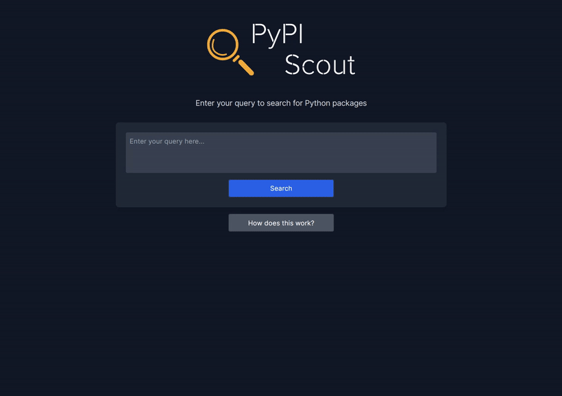

<p align="center">
  
</p>

Find Python Packages on PyPI packages with the help of vector embeddings .



## What does this do?

Finding the right Python package on [PyPI](https://pypi.org/) can be a bit difficult, since PyPI isn't really designed for discovering packages easily. For example, you can search for the word "plot" and get a list of hundreds of packages that contain the word "plot" in seemingly random order.

Inspired by [this blog post](https://koaning.io/posts/search-boxes/) about finding arXiv articles using vector embeddings, I decided to build a small application that helps you find Python packages with a similar approach. For example, you can ask it "I want to make nice plots and visualizations", and it will provide you with a short list of packages that can help you with that.

## How does this work?

The project works by collecting project summaries and descriptions for all packages on PyPI with more than 50 weekly downloads. These are then converted into vector representations using [Sentence Transformers](https://www.sbert.net/). When the user enters a query, it is converted into a vector representation, and the most similar package descriptions are fetched from the vector database. Additional weight is given to the amount of weekly downloads before presenting the results to the user in a dashboard.

## Architecture

The project uses the following technologies:

1. **[Pinecone](https://www.pinecone.io/)** as vector database
2. **[FastAPI](https://fastapi.tiangolo.com/)** for the API backend
3. **[NextJS](https://nextjs.org/) and [TailwindCSS](https://tailwindcss.com/)** for the frontend
4. **[Sentence Transformers](https://www.sbert.net/)** for vector embeddings

<br/>


## Getting Started

### Prerequisites

1. **Set Up Pinecone**

   Since PyPI Scout uses [Pinecone](https://www.pinecone.io/) as the vector database, register for a free account on their website. Obtain your API key using the instructions [here](https://docs.pinecone.io/guides/get-started/quickstart).

2. **Create a `.env` File**

   Copy the `.env.template` to create a new `.env` file:

   ```sh
   cp .env.template .env
   ```

   Then add your Pinecone API key from step 1 to this file.

### Build and Setup

#### 1. **Run the Setup Script**

The setup script will:

- Download and process the PyPI dataset and store the results in the `data` directory.
- Set up your Pinecone index.
- Create vector embeddings for the PyPI dataset and upsert them to the Pinecone index.

There are three methods to run the setup script, dependent on if you have a NVIDIA GPU and [NVIDIA Container Toolkit](https://docs.nvidia.com/datacenter/cloud-native/container-toolkit/latest/install-guide.html) installed. Please run the setup script using the method that is applicable for you:

- [Option 1: Using Poetry](SETUP.md#option-1-using-poetry)
- [Option 2: Using Docker with NVIDIA GPU and NVIDIA Container Toolkit](SETUP.md#option-2-using-docker-with-nvidia-gpu-and-nvidia-container-toolkit)
- [Option 3: Using Docker without NVIDIA GPU and NVIDIA Container Toolkit](SETUP.md#option-3-using-docker-without-nvidia-gpu-and-nvidia-container-toolkit)

> [!NOTE]
> Although the dataset contains all packages on PyPI with more than 50 weekly downloads, by default only the top 25% of packages with the highest weekly downloads (those with more than approximately 650 downloads per week) are added to the vector database. To include packages with less weekly downloads in the database, you can increase the value of `FRAC_DATA_TO_INCLUDE` in `pypi_scout/config.py`.

#### 2. **Run the Application**

Start the application using Docker Compose:

```sh
docker-compose up
```

After a short while, your application will be live at [http://localhost:3000](http://localhost:3000).

## Data

The dataset for this project is created using the [PyPI dataset on Google BigQuery](https://console.cloud.google.com/marketplace/product/gcp-public-data-pypi/pypi?project=regal-net-412415). The SQL query used can be found in [pypi_bigquery.sql](./pypi_bigquery.sql). The resulting dataset is available as a CSV file on [Google Drive](https://drive.google.com/file/d/1huR7-VD3AieBRCcQyRX9MWbPLMb_czjq/view?usp=sharing).
